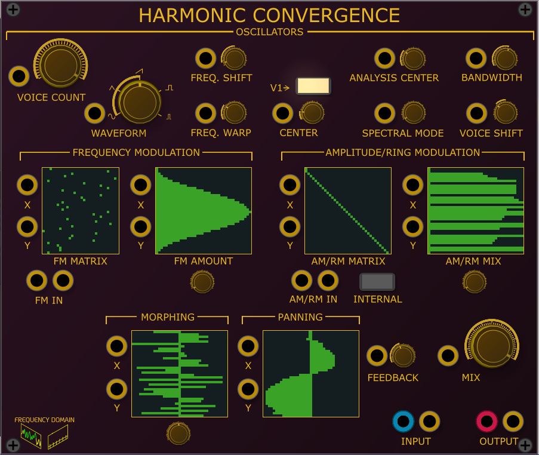
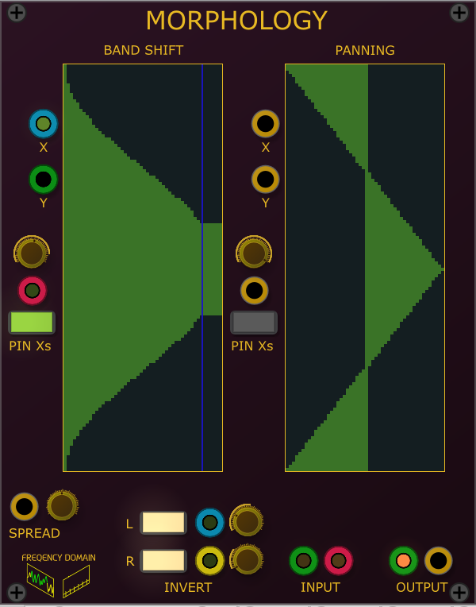

# Spectre Modular VCV plugins

Frequency Domain based VCV Plugins

## Harmonic Convergence

- Spectral Resyntheszer
- Takes one or two inputs, analyzes their spectal content and then drives up to 36 oscillators based on that
- The Morph panel controls the how much each input controls each individual osccilator.
- Panning allows each oscillator to be placed in the stereo field
- Frequency Shift shifts all oscillators +/- 3 octaveas
- Frequency Warp pushes oscilator's frequency away from center frequency - if the V1 switch is on, the center frequency tracks the main oscillator and Center control adds an offset
This is great for creating inharmonic sounds
- Spectral Mode changes how the most prominent frequency bands drive the voice oscillators
- Voice Shift allows the magnitude of one frequency to control another
- Frequency Modulation input is polyphonc. You can have up to 16 FM inputs. The FM Matrix controls which FM input (x axis) modulates which oscillator (y axis).
- FM Amout allows per oscillator FM control
- RM Matrix allows oscillators to Ring Modulate one another. RM Mix controls the blend between the original oscillator voice and the results of ring modulation 

## Delayed Reaction

- In loving memory of Native Instrument's Spektral Delay.
- Each frequency band can have its own initial volume level, delay time and feedback amount
- 2 or more Delayed Reactions can be used as expanders. When the LINK is enabled, drawing a curve on the master DR copies it to the others.
- the PIN0s keep values that are 0 at 0, even if being CV'd

## Morphology

- Essentially a spectral based vocoder.
- Frequency bands can be placed individually in the stereo field
- Band spread allows frequency bands to modulate its neighbors.
- Inverter buttons make loudest frequency bands the quietest and vice-versa
