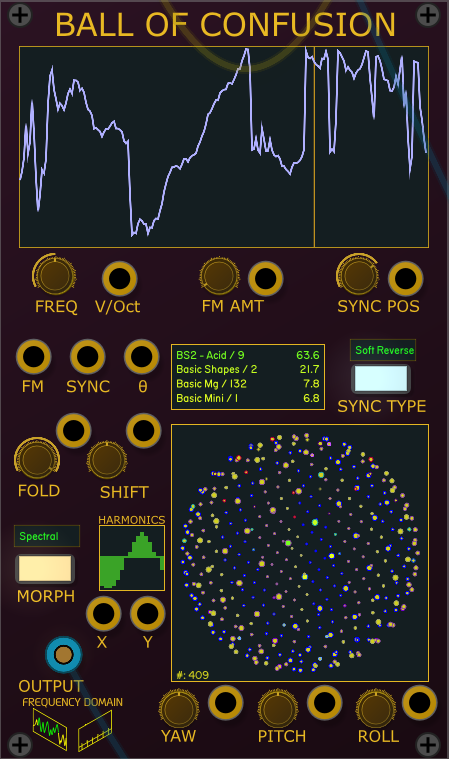
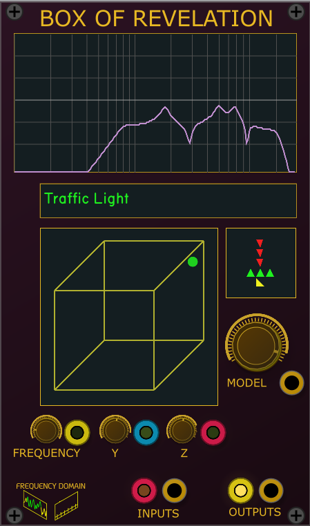
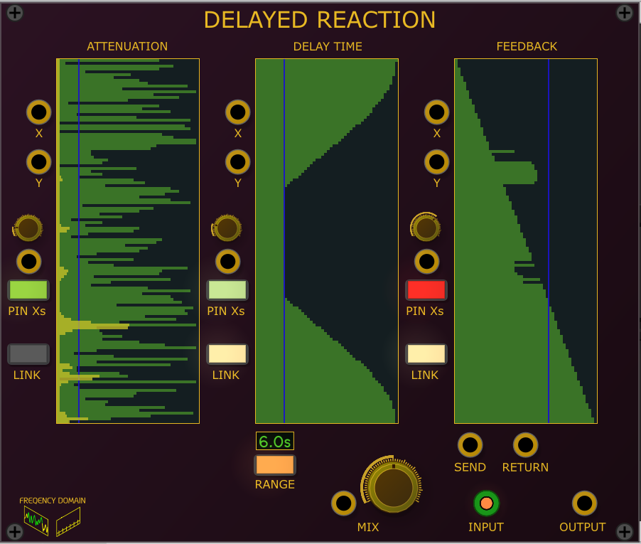
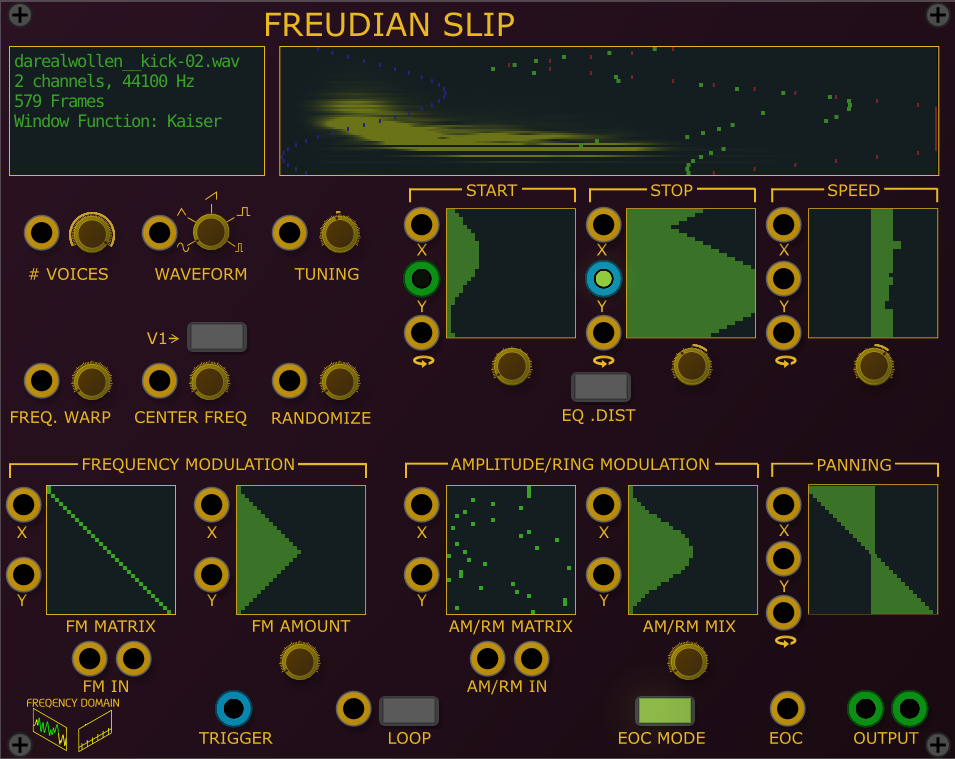

# Frequency Domain VCV plugins

Frequency domain based VCV Plugins
## Ball of Confusion

- A true Spherical Wavetable Oscillator
- Uses wavetables based on the Serum standard (WAV files with each table having 2048 points)
- Load Directory/Load Wavetable will reset sphere to load each file of directory/individual file 
- Add Wavetable will add the wavetable file to existing configuration
  * Note: Serum Wavetable files can contain multiple samples per file
- Each point on the sphere represents a waveform (wavetable files can contain multiple waveforms)
- Each file has its own color on the sphere
- Scatter will adjust distribution of sample on sphere so that samples from same file are not adjacent, which allows for potentially more intersting combinations
- The YAW, PITCH and ROLL Controls rotate the spehre to allow different wavetables to be used. The four wave tables closest to a point near the center of the sphere will be morphed together - the amount each wavetable controbutes to the final waveform is based on how close each one is to this point.
- MORPH Modes
  * Interpolate: Averages each point from up to 4 samples based on their distance. Samples closer to the origin point contribte more.
  * Spectral:  Uses FFT analysis to average the spectrums of each wavetable to create a composite waveform based on the frequency domain
  * Spectral 0: Ignores the phase component of the FFT analysis
  * Transfer: Takes the interpolation of 3 samples and uses that as a transfer function on the first wave table
- SYNC Modes
  * Hard: and a signal is sent to the SYNC input, then each time thas signal crosses 0, the waveform is reset.
  * Soft: if the phase of the waveform is before the SYNC POS (th e gold line) when the SYNC Input crosses 0, the waveform will be reset.
  * Soft Reverse: if the phase of the waveform is before the SYNC POS (the gold line) when the SYNC Input crosses 0, the waveform will be reversed.
- SHIFT
  * In interpolation and transfer modes, shifting changes which values are used to used to create composite waveform. within the four wavetables being used to create the composite waveform, the lower the ranking, the greater the shift.
  * In the Spectal modes,  shifting changes which frequency bands are used to used to create composite waveform. within the four wavetables being used to create the composite waveform, the lower the ranking, the greater the band shift. this tends to add greater harmonics
- The Fold Control allows distortion of the wave shape using standard wavefolding technique 
- THe Harmonics grid allows you to control the levels of the first 16 harmonics - NOTE: This only works while using the 2 Spectral Morph Modes

## Box of Revelation

- Inspired by a well known Eurorack module
- Each cube model consists of up to 7 filters in a parallel/serial configuration
- Each vertex of the cube represents the parameters of those 7 filters
- By navigating through the cube using the Frequency, X and Y paramters, you can morph between these parameters
- You can edit the json file and create your own cubes - there is a read me file in the preset directory with instructions.
- There can be multiple cube files and you can load each module with diffrent files if you want.
- Filters can have non-linear properties which adds a drive parameter, the higher the drive, the more red the frequency response display
- Filter Topology Display shows the serial/parallel configuration of the (up to) 7 filters, and what type they are (LP,HP,BP,NR, Comb and Modal)
- A green filter is normal/linear. Yellow - non-liner state path, Orange - non-linear feebback path, Red - both state and feedback paths are non-linear
- New cubes will be added :)

## Dance This Mesh Around

- Banded WaveGuide synthesizer with a waveguide mesh
- Needs an impulse to create a sound (like from Heat of the Moment)
- Signal is split into three frequency ranges, two go into simple waveguides (basically short duration delays), while the high frequencies go into the mesh
- With careful tweaking, nice inharmonic gong sounds can be created (be careful with high feedback and non-linearity settings)
- Three mesh topologies - Rectalinear, Triangle and Cubic. 
- The Mesh size can be from 2-5 junctions per dimension. Higher sizes don't sound that much different, but use *lots* more CPU.

## Delayed Reaction

- In loving memory of Native Instrument's Spektral Delay.
- Each frequency band can have its own initial volume level, delay time and feedback amount
- Right click to adjust Windowing Function and Frame Size
- Right click on grids to choose from default shapes or transform patterns
- Send and Return allow the Feedback to be further processed
- 2 or more Delayed Reactions can be used as expanders. When the LINK is enabled, drawing a curve on the master DR copies it to the others.
- PINxs have five modes
  * Off - PinX control has no effect
  * Light Green - values (without CV) less than pinX axis are set to pinXs value, otherwise use value (+ cv)
  * Green - values (without CV) less than pinX axis are unchanged, otherwise use value (+ cv)
  * Pink - values (without CV) greater than pinX axis are set to pinXs value, otherwise use value (+ cv)
  * Red - values (without CV) greater than pinX axis are unchanged, otherwise use value (+ cv)
- Rotation allows rotating x values around the oinX axis

## Freudian Slip

- Sample based Spectral Resyntheszer
- Right click to load sample
- Analyzes the sample's spectal content and then drives up to 32 oscillators based on that analysis
- Right click to adjust Windowing Function which alters harmonic content  
- Right click on grids to choose from default shapes or transform patterns
- Start and Stop grids control where in the sample playback starts/stops
- If Equal distance mode is on, each voice will travel the same distance whether playing forward or backwards  
If voices are playing forward and backwards simultaneously, this means they may not stop at the same position  
but it minimizes cases where no sound is heard
- Speed cobtrols the speed or duration of the playback without changing pitch
- Negative play speeds play sample in reversse
- By drawing a curve, each voice can have its own play speed - even ones where some voices go forwards, others in reverse
- Voice Count specifies how many oscillators are used (1-32)
- Waveform specifies what waveform the oscillators output
- Frequency Warp pushes oscilator's frequency away from CENTER frequency 
- If the V1 switch is on, the center frequency tracks the main oscillator and CENTER control adds an offset  
This is great for creating inharmonic sounds
- Frequency Modulation inputs are polyphonic. You can have up to 32 FM inputs (using both FM inputs). 
- Randomize controls amount of randoming stepping between frames
- FM Matrix controls which FM input (x axis) modulates which oscillator (y axis).
- FM Amount allows per oscillator FM control
- RM/AM inputs are polyphonic. You can have up to 32 inputs (using both RM/AM inputs).  
- RM/AM Matrix controls which AM/RM input (x axis) modulates which oscillator (y axis).
- AM/RM Mix controls the amount of amplitude modulation 
- Panning allows each oscillator to be placed in the stereo field
- EOC Mode controls when the EOC pulse is sent and when the sample loops
  * Green - EOC is when all voices finish
  * Orange - EOC is when first voice finishes
- X AND Y inputs on all grids allow CV Modulation of grid in either dimension
- Panning and Play Speed grids have rotate CV input that rotates x values around the y axis

## Grains of Wrath

- Sample and Live input Granular Synthesizer
- Most parameters use FD's grid controls. You can either draw your own shapes, or right click to choose a preset pattern, or to modify the exisiting pattern
- These patterns can be modified by CV - either shifted vertically, horizontally or rotated around the Y axis.
- Right click on module to load individual samples or use a directory to fill slots
- If a Sample's play speed is 0, then the Start Position is used to determine where grain comes from.
- If a Sample's play speed is non-zero, then the sample plays forward (or backwards) and the grain is pulled from current position
- The Live Input is polyphonic - up to 16 live inputs can be used.
- Unused voices (either samples or live inputs, are red in the voice weighting grid and do not contribute to grain selection)
- A voice is either a sample or live input - there can be a total of 32 voices 
- Voice Weighting determines the chance a sample or live voice will be used to generate a grain. Weighting is relative, so if all voices have same value, they have the same chance.
- Weighting can vary from linear to logarithmic (logarithmic lowers chance of lower percentages)
- Grain Density controls how often a grain is created, its range is from one every 10 seconds to 1000/sec. The RANDOM knob changes the grain spawn time up to +/- 50%.
- If a clock is fed into the EXTERNAL input, it is used to create Grains.
- Each voice can use an envelope to shape its grains. In order they are None, Triangle, Welch, Sin, Hanning, Blackman, Nutall, Kaiser, Exponential Decay, Exponential Attack
- Each voice can have its own grain size. at 44.1KHz sample rate they range from 1ms to 200ms.
- Each voice can have its grains pitch shifted from -3 to +3 octaves. By holding shift key when drawing on grid, each voice can have a random range of pitch shifting.
- Each voice can have its grains panned. By holding shift key when drawing on grid, the panning can have a random range.
- Pitch and Panning randomness can use Gaussian curves which tend to cluster more towards the original value.
- The FREEZE input is polyphonic, when frozen, the corresponding live voice stops recording and uses its current buffer for its grain source. 
   Frozen voices are blue in the voice weighting grid.
- There are two REVERSE inputs, the first for samples, the second for live inputs. Both are polyphonic. When a voice is reversed, the grains are read from the buffer in reverse order.
- The FREEZE and REVERSE inputs can either be Gates or Triggers depending on mode selected.
- The Grain Display shows how many grains are currently active and which voice generated them.
  Grains with larger sizes will be longer in the grain display.
  The if the pitch is shifted lower, it will become more red. If it shifted higher, it is more green,
  Reversed grains have a white border around them.
  When a grain is spawned it starts at the left-most edge, then moves right (but this happens *very* quickly)

## Harmonic Convergence

- Live Spectral Resyntheszer
- Takes one or two inputs, analyzes their spectal content and then drives up to 36 oscillators based on that analysis
- Right click to adjust Windowing Function and each inputs' Frame Size  
Smaller frame sizes handle transients (like drums and speech beter), but the pitch becomes less accurate   
Large frame sizes more accurately detect pitch, but can make some input sounds seem like they have reverb
- Right click on grids to choose from default shapes or transform patterns
- The Morph panel controls the how much each input contributes to each individual osccilator.
- Voice Count specifies how many oscillators are used (1-36)
- Waveform specifies what waveform the oscillators output
- Frequency Shift shifts all oscillators +/- 3 octaveas
- Frequency Warp pushes oscilator's frequency away from CENTER frequency 
- If the V1 switch is on, the center frequency tracks the main oscillator and CENTER control adds an offset  
This is great for creating inharmonic sounds
- Analysis Center and Bandwidth specify which portions of the FFT are analyzed and used for voicing. Center at 50% and Bandwidth full (the defaults) means everything gets used.
- Spectral Mode changes how the most prominent frequency bands drive the voice oscillators
- Voice Shift allows the magnitude of one frequency to control another
- Frequency Modulation inputs are polyphonic. You can have up to 32 FM inputs (using both FM inputs). 
- FM Matrix controls which FM input (x axis) modulates which oscillator (y axis).
- FM Amount allows per oscillator FM control
- RM/AM inputs are polyphonic. You can have up to 32 inputs (using both RM/AM inputs).  
- RM/AM Matrix controls which AM/RM input (x axis) modulates which oscillator (y axis).
- If Internal is turned on the RM Matrix allows oscillators to Ring Modulate one another. 
- AM/RM Mix controls the amount of amplitude modulation 
- In Internal mode, AM/RM Mix controls the blend between the original oscillator voice and the results of ring modulation 
- Panning allows each oscillator to be placed in the stereo field
- X AND Y inputs on all grids allow CV Modulation of grid in either dimension

## Heat of the Moment

- Impulse Generator
- Takes a gate input and sends out windowed noise impulses
- Different colors of noise can be generated, and different window functions used to shape its envelope
- The noise impulse can have 1-4 peaks
- The duration of the impulse can be controlled
- If the gate is held open, the impulse will retrigger based on the repeat time parameter

## Morphology

- Essentially a spectral based vocoder.
- Frequency bands can be placed individually in the stereo field
- Band spread allows frequency bands to modulate their neighbors.
- Inverter buttons make loudest frequency bands the quietest and vice-versa
- Each input has a CV controllable Invert threshold which determines how loud a band must be for it to be inverted.  
At low thresholds the input can become very noisey  
- Right click to adjust Windowing Function and Frame Size
- Right click on grids to choose from default shapes or transform patterns
- Rotation allows rotating x values around the oinX axis
